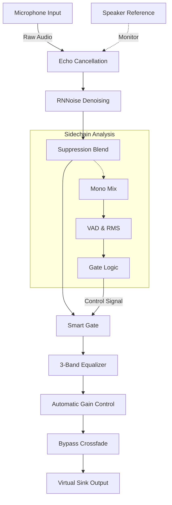
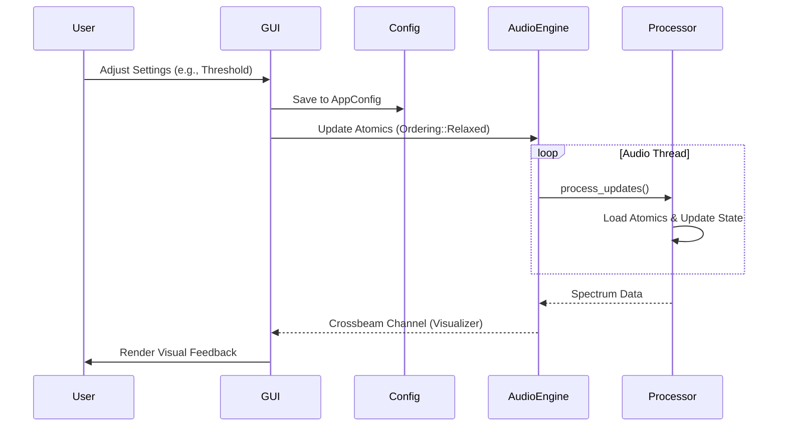
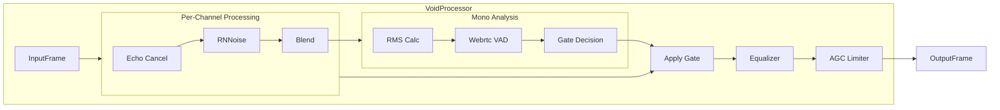

# VoidMic 🌌 (Hybrid Edition)


[](https://github.com/Detair/voidvoice/actions/workflows/ci.yml)
[](https://github.com/Detair/voidvoice/actions/workflows/release.yml)
[](https://opensource.org/licenses/MIT)
[](https://github.com/google-gemini)

**VoidMic** is a high-fidelity noise reduction tool designed for high-noise environments like **Sim Racing** and **Mechanical Keyboards**.

It uses a **Hybrid Engine**:
1.  **RNN Denoising (RNNoise):** Removes steady background noise (fans, hum, traffic).
2.  **Smart Noise Gate:** Actively silences transient clicks (keyboards, shifters) when you aren't speaking.
3.  **Echo Cancellation (AEC):** Removes speaker feedback for headphone-free gaming.

## 🚀 Features

- **Hybrid Engine**: RNNoise + Smart Gate + AEC.
- **Echo Cancellation**: Play without headphones using WebRTC AEC3.
- **System Tray**: Minimize to tray, toggle microphone processing globally.
- **Auto-Start**: Start minimized and processing automatically on launch.
- **Output Filtering**: Denoise incoming audio (like Discord calls) before it hits your speakers.
- **Process Management**: Daemon mode (`voidmic load`) or headless server mode.
- **Auto Virtual Sink**: Automatically creates virtual devices on Linux.
- **Visual Meter**: Real-time feedback on gate status.
- **Themes**: Dark and Light mode support.
- **Cross-Platform**: Linux, Windows, macOS.

## 🗺️ Roadmap
- [x] Cross-platform support
- [x] Hybrid AI + Gate Engine
- [x] Auto-updater
- [x] Tray icon support
- [x] Echo Cancellation
- [x] Headless / Daemon mode
- [x] Flatpak support

## 📥 Build & Install

### 🐧 Arch Linux / Standard Linux
```bash
# Install dependencies (ALSA, PulseAudio/PipeWire)
sudo pacman -S alsa-lib pulseaudio

# Build
cargo build --release

# Run
./target/release/voidmic
```

### 📦 Flatpak
```bash
# 1. Install Flatpak Builder
flatpak install org.freedesktop.Sdk.Extension.rust-stable//23.08

# 2. Build and Install
flatpak-builder --user --install --force-clean --share=network build-dir build-aux/com.voidmic.VoidMic.yml

# 3. Run
flatpak run com.voidmic.VoidMic
```

### 🖥️ Headless / Server
For minimal systems:
```bash
cargo build --release --no-default-features
./target/release/voidmic run -i default
```

### 🪟 Windows
1.  Install **Rust**.
2.  Install **BSVC** (C++ Build Tools).
3.  `cargo build --release`
4.  Run `.\target\release\voidmic.exe`

## 🎮 Usage Guide

### GUI
1.  **Select Devices**: Mic as Input, Virtual Sink as Output.
2.  **Settings & Polish**:
    *   **Auto-Start Processing**: Start noise reduction immediately on launch.
    *   **Start Minimized**: Launch directly to the system tray.
    *   **Dark Mode**: Toggle between dark and light themes.
3.  **Advanced Features**:
    *   **Filter Output**: Check this to denoise what you hear.
    *   **Echo Cancellation**: Check this if using speakers. Select your "Speaker Monitor" as the reference.

### System Tray
- **Left Click**: Open main window.
- **Right Click Menu**:
    *   **Show/Hide**: Toggle window visibility.
    *   **Enable/Disable**: Quick toggle for microphone processing.
    *   **Quit**: Exit application fully.

### Daemon (NoiseTorch-like)
```bash
# Load: Create virtual sink and start background process
voidmic load -i default

# Unload: Stop and cleanup
voidmic unload
```

## 🧩 Architecture Diagrams

### Signal Flow


### User Interaction


### Data Processing (VoidProcessor)


## 🧠 AI Transparency
Architected with **Google Gemini** and **Antigravity AI**.

## 📄 License
MIT License.